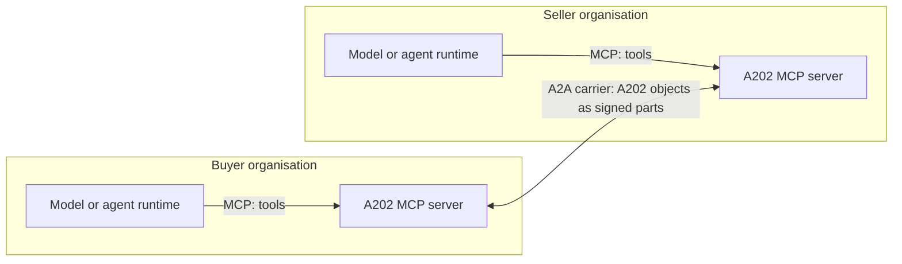

# A202 with A2A and MCP

**Status:** Informative in full. This page describes how A202 composes with
two protocols it is designed to travel over, as a matter of technical
relationship. It states no requirement; the normative rules are in the
documents it links to.

## Three protocols, three jobs

A202 defines commercial meaning and deliberately defines no transport. The
Agent2Agent protocol (A2A) defines how two agents talk to each other. The
Model Context Protocol (MCP) defines how a model reaches tools and context. The three compose rather than compete: an agent can hold
A202 capabilities through MCP, speak to a counterparty's agent over A2A, and
what makes the resulting commitments verifiable is A202.

The division of labour matters because each protocol fails differently. A
carrier failure is a delivery problem; an authority failure is a commercial
problem. A202 keeps the second class out of the first: no carrier
acknowledgement, and no transport status code, is ever acceptance of an
offer. Acceptance is a signed object, and an accepted submission returns
HTTP 202, a rule the specification makes literal in
[A202-0017](../proposals/A202-0017-submission-success-status.md).

## Over A2A: the carrier binding

The [A2A carrier binding](../bindings/a2a-binding-v0.1.md) states how A202
objects travel between agents over A2A:

- A202 objects ride as parts of A2A messages, unchanged. The carrier
  envelope carries delivery metadata; commercial meaning stays inside the
  signed object, and the binding forbids the two from mixing.
- Support is declared through an extension declaration, and every failure
  mode of the declaration check returns the single refusal
  `A202-EXTENSION-UNSUPPORTED`, so a counterparty that cannot verify never
  half-participates.
- The binding is one of two defined in
  [A202-0001](../proposals/A202-0001-carrier-bindings.md); the other is
  plain HTTPS, for a party with no agent stack at all.

## Over MCP: the reference server

The reference implementation includes an [A202 MCP
server](../reference/a202_mcp/README.md) that exposes, as MCP tools, the
seven capabilities two organisations need in order to buy and sell from each
other directly: issue a mandate, check what an agent may do under it,
approve an act that needs a person, form an agreement, exchange obligations,
verify a record, and read the transaction record back.

The server enforces the specification's rules at the tool boundary: an act
outside the mandate's constraints is refused, an approval binds to the exact
action hash it approved, and verification replays the signed record rather
than trusting the caller's summary.

## What this page is not

This page describes composition with carriers the repository defines
bindings or reference code for. It is not a survey of adjacent protocols,
and it makes no claim about any specification not linked here.
