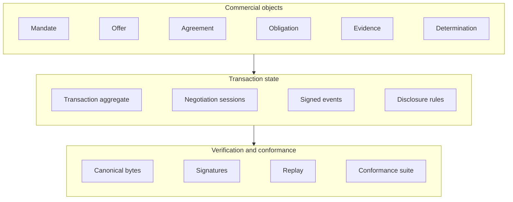

v0.1 working documents

# A202

The Verifiable Agreement Protocol for Agent-Led Commerce

An open, carrier-neutral specification of commercial authority, negotiation
state, and verifiable conformance for transactions between independent
organisations, including transactions conducted on their behalf by software
agents.

[Read the introduction](introduction.md){ .md-button .md-button--primary }
[The specification](../schemas/canonical-commercial-model-v0.1.md){ .md-button }
[The charter](../CHARTER.md){ .md-button }

## Five questions every transaction must answer

Two organisations that have never transacted before need a shared answer to a
small number of questions. Existing agent, payment, and identity
specifications answer parts of the first and none of the rest. A202 specifies
the missing layer.

- :material-account-key:{ .lg .middle } **Authority**

    ---

    Who is this counterparty, and who inside it authorised this act? What
    exactly was that party permitted to commit to, and was the act inside
    that permission?

    [Commercial mandate](../authority/commercial-mandate-v0.1.md)

- :material-state-machine:{ .lg .middle } **State**

    ---

    What state is this transaction in, and what changed it? Only a signed,
    authorised event moves state. A message, a model output, and a database
    write do not.

    [Transaction state machine](../negotiation/pilot-transaction-state-machine-v0.1.md)

- :material-eye-off:{ .lg .middle } **Disclosure**

    ---

    What did the other side learn, and what did it not? Disclosure is a
    declared policy with a default of revealing nothing across
    counterparties, and every disclosure is a recorded event.

    [Canonical commercial model](../schemas/canonical-commercial-model-v0.1.md)

- :material-history:{ .lg .middle } **Record**

    ---

    If this is disputed a year from now, what can be reconstructed, by whom,
    from what? Every claim is checkable by replaying signed records, with no
    privileged access to anyone's infrastructure.

    [Evidence verification](../evidence/evidence-verification-v0.1.md)

## Three layers

The specification set is organised in three layers that work together, and
each layer is checkable on its own.

Typed objects carry commercial meaning: who may act, what was offered, what
was agreed, what is owed, what was proven, what was decided. Two state
machines govern how those objects move a transaction, one for the aggregate
and one for each bilateral session inside it. Underneath both, every object
canonicalises to exact bytes, every commitment is a signature over those
bytes, and an executable suite of 148 fixtures decides whether an
implementation agrees with the specification.

## Meaning, not transport

A202 is carrier-neutral by construction: it defines what objects mean, not
how they travel. Objects defined here may be carried, wrapped, or referenced
by another protocol without changing what they mean.

- **[A2A carrier binding](../bindings/a2a-binding-v0.1.md)**: how A202
  objects travel between agents over the Agent2Agent protocol, with a
  declared extension and closed failure modes.
- **[A202 MCP server](../reference/a202_mcp/README.md)**: a reference server
  giving an agent, over the Model Context Protocol, the seven capabilities
  two organisations need in order to buy and sell from each other directly.

[How A202 composes with A2A and MCP](carriers.md){ .md-button }

## Where to go next

- :material-book-open-variant:{ .lg .middle } **Specification**

    ---

    The canonical commercial model, the object families, and the state
    machines, each marking its own normative sections.

    [Introduction](introduction.md)

- :material-check-decagram:{ .lg .middle } **Conformance**

    ---

    An executable fixture set and a normative runner. Schema validity is
    necessary and not sufficient, and grades are earned per role scope.

    [Conformance grades](../conformance/conformance-grades-v0.1.md)

- :material-source-branch:{ .lg .middle } **Proposals**

    ---

    Every normative change lands under a numbered proposal, so the record
    of why the specification says what it says is public.

    [The proposal process](../proposals/README.md)

- :material-scale-balance:{ .lg .middle } **Governance**

    ---

    How the project is run, what the sponsor does and does not control, and
    when the governance is reviewed.

    [Governance](../GOVERNANCE.md)

---

**Status: released, pre-1.0.** `v0.1.0` is the current release under the
release policy in [RELEASES.md](../RELEASES.md), and the specification is
licensed under the [Apache License, Version 2.0](../LICENSE).
