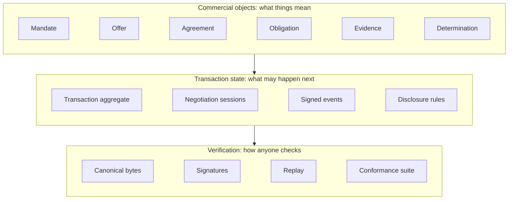

# Introduction

**Status:** Informative in full. This page orients a reader; it states no
requirement. Every rule it mentions is normative in the specification
document it links to, and where this page and a specification document
disagree, the document is the definition.

## What A202 specifies

A202, the Verifiable Agreement Protocol for Agent-Led Commerce, specifies
how two independent organisations, or the software agents acting for them,
reach commitments that either side can later prove: who had authority to
act, what was offered and agreed, what is owed, what was disclosed to whom,
and how any of it is verified from the record alone.

The full statement of purpose, scope, non-goals, and design principles is
the [charter](../CHARTER.md). The adversaries the specification assumes and
the properties it defends are the [threat model](../THREAT-MODEL.md).

## The three layers

**Commercial objects.** Typed objects carry commercial meaning on a common
envelope: delegated authority as a [commercial
mandate](../authority/commercial-mandate-v0.1.md), the terms of a deal as an
offer and an [agreement](../schemas/canonical-commercial-model-v0.1.md),
what is owed as an [obligation](../agreement/obligation-v0.1.md), what was
proven as [evidence](../evidence/evidence-verification-v0.1.md), and what
was decided as a [determination](../disputes/determination-v0.1.md). Domain
vocabulary enters through [transaction
profiles](../schemas/transaction-profile-extension-model-v0.1.md) without
changing the kernel.

**Transaction state.** Two state machines govern movement: one for the
transaction aggregate and one for each bilateral session inside it, with
guarded transitions, per-stream concurrency, and replay rules, in the
[transaction state
machine](../negotiation/pilot-transaction-state-machine-v0.1.md). Event
semantics and disclosure rules for competitive bidding are in [auction event
semantics](../negotiation/auction-event-semantics-v0.1.md). Parties with no
prior presence enter one named transaction through a [counterparty
invitation](../discovery/counterparty-invitation-v0.1.md).

**Verification and conformance.** Every object canonicalises to exact bytes
and every commitment is a signature over them, per the [canonical commercial
model](../schemas/canonical-commercial-model-v0.1.md). The [conformance
suite](../conformance/conformance-grades-v0.1.md) turns the rules into 148
executable fixtures, and [role
scopes](../conformance/conformance-role-scopes-v0.1.md) name the surface a
grade covers. Settlement is handed off to payment rails as an authorised
instruction, per the [settlement
handoff](../fulfillment/settlement-handoff-v0.1.md).

## How to read the documents

Every document carries a status header stating which of its sections are
**normative** and which are **informative**. The normative keywords `MUST`,
`MUST NOT`, `SHOULD`, and `MAY` are used in the RFC 2119 sense, and only
inside sections marked normative.

Schema validity is necessary and not sufficient: an implementation that
passes every schema and violates an invariant of the canonical model is not
conformant. That gap is why the conformance suite exists, and running it is
two commands, described in the [schemas overview](../schemas/v0.1/README.md).

## A reading order

1. The [charter](../CHARTER.md), for what this is and what it deliberately
   is not.
2. The [canonical commercial model](../schemas/canonical-commercial-model-v0.1.md),
   for the object model, the envelope, and the invariants schema validation
   cannot express.
3. The [transaction state machine](../negotiation/pilot-transaction-state-machine-v0.1.md),
   for what moves state and what does not.
4. The [conformance manifest](../conformance/manifest-v0.1.json), for the
   fixtures that decide whether an implementation agrees with either of the
   above.

Every normative change that produced the current text landed under a
numbered proposal, and the [proposals](../proposals/README.md) are published
so the record of why the specification says what it says is public.
