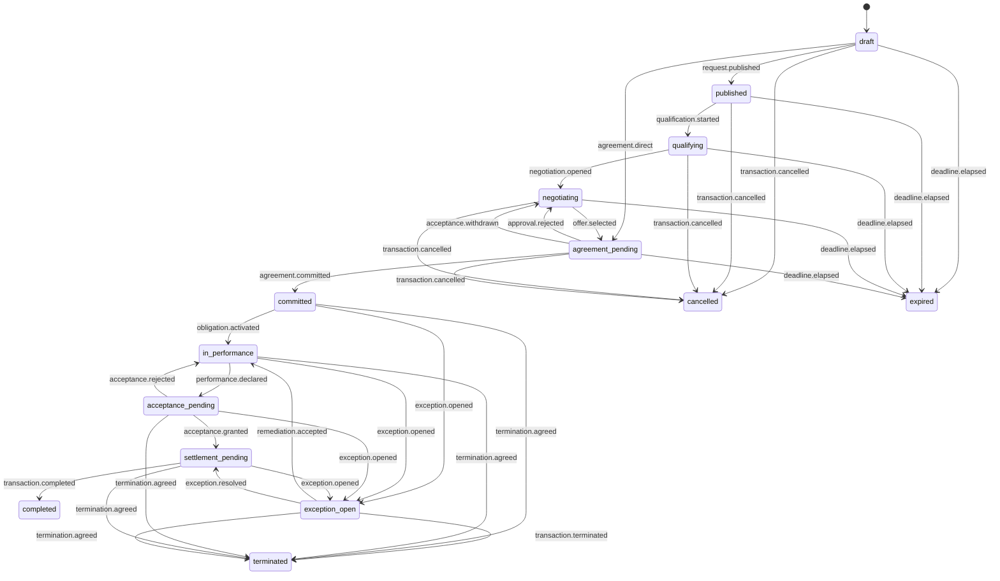

# Pilot transaction state machine v0.1

**Status:** Experimental working specification. Mixed. Sections 1, 3, 5, 6, 7, 8, 9, 10, and 11 are **normative**. Sections 2 and 4 are **informative** and state no requirement on an implementation.

**Date:** 25 July 2026

**Revised:** 30 July 2026, under [A202-0014](../proposals/A202-0014-bilateral-formation-and-scope-repair.md): the `agreement.direct` transition and rules version 1.3, the bilateral transaction record in section 8.1, the operated reading of `offer.selected` corrected in section 6.2, and the required tests for the direct formation path. Previous revision 28 July 2026, under [A202-0010](../proposals/A202-0010-model-completion.md): the `termination.agreed` and `agreement.amended` transitions, and the error-code table completed as the registry, with the codes other documents and the manifest were already using. 26 July 2026 added the invitation events; 25 July 2026 followed conformance review.

## 1. Rule

Only signed, authorized events move transaction state. Agent messages, model outputs, adapter callbacks, and database updates do not move state by themselves.

## 2. Two levels of state

The pilot has two state machines, not one.

| Level | Scope | Stream |
|---|---|---|
| Transaction aggregate | The whole commercial request, across all counterparties | `transaction` |
| Negotiation session | One bilateral relationship with one counterparty | `session` |

They are separated for confidentiality, not for tidiness. A single shared sequence counter across concurrent bilateral sessions leaks rival activity: a supplier that observes the counter advance, or that receives a sequence conflict, learns that a competitor acted and when. Section 8 defines the concurrency rules that follow from this.

## 3. Aggregate states

| State | Meaning |
|---|---|
| `draft` | Request exists privately and is not discoverable |
| `published` | Bounded request is visible to the configured audience |
| `qualifying` | Candidate counterparties are presenting required evidence |
| `negotiating` | At least one private negotiation session is active |
| `agreement_pending` | One offer is selected and awaits authority, approval, or signatures |
| `committed` | Both parties signed the same agreement hash |
| `in_performance` | At least one obligation is active |
| `acceptance_pending` | Required performance was declared and awaits acceptance |
| `settlement_pending` | Acceptance conditions are met and a settlement instruction may be routed |
| `completed` | All required obligations and settlement conditions for the pilot are complete |
| `exception_open` | A performance, evidence, adapter, or settlement exception needs resolution |
| `cancelled` | A pre-commit transaction was cancelled |
| `expired` | A pre-commit deadline elapsed |
| `terminated` | A committed transaction ended through an authorized termination path |

`cancelled`, `expired`, `completed`, and `terminated` are terminal in v0.1.

## 4. State diagram

## 5. Aggregate transition table

| Current | Event | Guard | Next | Required side effect |
|---|---|---|---|---|
| `draft` | `request.published` | Publisher mandate permits disclosure; request schema valid | `published` | Add directory index |
| `draft` | `agreement.direct` | No session stream exists on the transaction; the referenced offer is current and unexpired; an `Acceptance` signs the exact offer hash; the offer carries the offeror's signature and the acceptance the offeree's | `agreement_pending` | Record the party-minted session identifier on the transaction record |
| `published` or `qualifying` | `invitation.issued` | Inviting mandate permits `invitation.issue`; disclosure constraints pass; rate limit and suppression pass; grant names exactly this transaction | unchanged | Deliver claim secret on the invited channel |
| `published` or `qualifying` | `invitation.claimed` | Claim secret matches; invitation live; channel proof verified; claimant's own principal issued a root mandate bounded to this transaction | unchanged | Register the candidate |
| `published` or `qualifying` | `invitation.declined` | Declining party controls the channel | unchanged | Suppress the channel for this inviting organization |
| `published` or `qualifying` | `invitation.expired` | Authoritative clock passed `expires_at` | unchanged | Delete the contact record after the retention window |
| `published` or `qualifying` | `invitation.revoked` | Inviting mandate permits `invitation.revoke` | unchanged | Invalidate the claim secret |
| `published` | `qualification.started` | At least one candidate and qualification profile exist | `qualifying` | Open qualification window |
| `qualifying` | `negotiation.opened` | Candidate passed required evidence checks | `negotiating` | Create isolated session and session stream |
| `negotiating` | `offer.selected` | Referenced offer is current and accepted in its session; selection authority valid | `agreement_pending` | Freeze single-award selection version |
| `agreement_pending` | `approval.requested` | Approval rule matched | `agreement_pending` | Notify exact approver |
| `agreement_pending` | `approval.rejected` | Approval binds selected offer hash | `negotiating` | Release selection freeze |
| `agreement_pending` | `acceptance.withdrawn` | Withdrawal authorized and before commitment | `negotiating` | Release selection freeze |
| `agreement_pending` | `agreement.committed` | Approvals complete; agreement names the acceptance; both parties sign the same hash | `committed` | Emit commitments and export-ready event; close competing sessions |
| `committed` | `obligation.activated` | Obligation derives from agreement | `in_performance` | Start due-condition monitoring |
| `in_performance` | `performance.declared` | Evidence manifest present | `acceptance_pending` | Notify accepting party |
| `acceptance_pending` | `acceptance.rejected` | Rejection reason and evidence present | `in_performance` | Activate rework obligation if agreed |
| `acceptance_pending` | `acceptance.granted` | Acceptance authority valid | `settlement_pending` | Permit settlement instruction |
| `settlement_pending` | `settlement.instructed` | Payment mandate and conditions valid | `settlement_pending` | Invoke sandbox payment adapter |
| `settlement_pending` | `transaction.completed` | All required obligations accepted; required receipts present | `completed` | Seal audit bundle |
| eligible pre-commit | `transaction.cancelled` | Canceller has authority; no committed agreement | `cancelled` | Close sessions and directory listing |
| eligible pre-commit | `deadline.elapsed` | Authoritative clock exceeds deadline | `expired` | Close sessions and directory listing |
| eligible committed | `exception.opened` | Exception type, scope, and evidence supplied | `exception_open` | Pause affected obligation |
| `exception_open` | `remediation.accepted` | Parties accept remediation hash | `in_performance` | Activate remediation obligation |
| `exception_open` | `exception.resolved` | Resolution conditions met | `settlement_pending` | Resume eligible settlement |
| `exception_open` | `transaction.terminated` | Termination authority and evidence valid | `terminated` | Seal termination audit bundle |
| eligible committed or `exception_open` | `termination.agreed` | Both parties signed the same termination record hash; the record names the disposition of every open obligation | `terminated` | Release named obligations; seal termination audit bundle |
| `committed` or `in_performance` | `agreement.amended` | Superseding agreement version formed per canonical model section 10.1: fresh offer, fresh acceptance, both signatures | unchanged | Record the superseding version; activate obligations the amendment adds |

Eligible pre-commit states are `draft`, `published`, `qualifying`, `negotiating`, and `agreement_pending`. Eligible committed states are `committed`, `in_performance`, `acceptance_pending`, and `settlement_pending`.

### 5.1 Invitation changes no aggregate state

The five invitation events are self-loops. An invitation is a fact about the market around a transaction, not a step in the transaction, and it grants participation rather than authority. The full object model, claim flow, custody rules, and abuse controls are in [counterparty-invitation-v0.1.md](../discovery/counterparty-invitation-v0.1.md).

`invitation.claimed` is how a candidate comes to exist when the request audience is invited rather than public. The `published` to `qualifying` guard, "at least one candidate and qualification profile exist", is satisfied by a claimed invitation exactly as it is satisfied by a directory response.

Invitation is denied from `draft`, because an unpublished request has no audience and inviting a party to it would disclose it outside the state machine. It is also denied from `negotiating` onward, because a late entrant joins a market that is already moving and this revision does not resolve the fairness and timing-disclosure questions that raises. Both refusals return `A202-STATE-TRANSITION-DENIED`.

Invitation events are readable by the inviting party and the operator. An invited party reads only its own invitation and its own acceptance, and never reads the transaction stream. This is why invitation did not get a third stream kind: a per-invitation stream would need sequencing, and any counter shared across invitations on one transaction is a covert channel of exactly the kind section 8 exists to prevent.

### 5.2 Consensual termination is not an exception

`transaction.terminated` ends a committed transaction through the exception path: something went wrong, the exception record says what, and termination is its resolution. `termination.agreed` ends one because both parties chose to end it. Before this event existed, two parties who agreed to walk away had to manufacture an exception in order to reach `terminated`, which put a false fault record on transactions that had none. The guard requires both signatures over one termination record hash for the same reason an agreement requires both over one agreement hash, and the record MUST name the disposition of every obligation that is not yet terminal, so that no obligation is left stranded in `pending`, `due`, `asserted`, `rejected`, or `disputed` on a transaction that no longer exists. The named obligations move to `released` under [obligation-v0.1.md](../agreement/obligation-v0.1.md) section 6.

### 5.3 Direct formation needs no venue

`agreement.direct` exists because the only route into `agreement_pending` ran through publication, qualification, and a negotiation room, and each of those three steps requires something neither party is. A request is published to a directory, candidates are qualified against a profile, and a session and its stream are created and ordered on `negotiation.opened`. Two organisations that already know each other, have each other's mandates, and have agreed terms had no way to record an agreement at all, and an implementation graded on the bilateral surface could not reach any state past `draft` without an operator. That is the defect this transition closes, and it is adopted through [A202-0014](../proposals/A202-0014-bilateral-formation-and-scope-repair.md).

Four things hold on the direct path, and each is a guard rather than a description.

1. **No session stream exists on the transaction.** The direct path is not a way around an open negotiation. Where a room is open, offers are contending in it, and a party that entered directly would be selecting itself out of a contest the other participants are still in. A record carrying both an `agreement.direct` event and a session stream on the same transaction is refused at replay with `A202-EVIDENCE-TRANSITION-ILLEGAL`, and live with `A202-STATE-TRANSITION-DENIED`.
2. **The offer is current and unexpired**, on the ordinary rules of section 7. Nothing about the entry path relaxes what makes an offer acceptable.
3. **The acceptance signs the exact offer hash**, so that the two parties have agreed to the same bytes rather than to the same description of them.
4. **Both parties have signed.** The offer carries the offeror's signature and the acceptance the offeree's, which is the same pair of acts section 10 of the canonical model already requires. The transition reaches `agreement_pending`, never `committed`: `agreement.committed` is still a separate event under its own guard, because approval, authority, and the dual signature over the agreement bytes are not established by the fact that an offer was accepted.

Skipping publication, qualification, and negotiation removes no check that bore on the agreement. Publication makes a request discoverable, qualification decides who may bid, and a negotiation room isolates concurrent counterparties from each other. Where there is one counterparty, already found, already known, and not concurrent with anyone, all three are answering questions nobody asked.

The session identifier does not disappear on this path. An `Offer` carries `session_id` and the schema keeps it REQUIRED, because a bilateral exchange is a session: it is one relationship with one counterparty, and every offer in it belongs to that relationship. What disappears is the ordering service. The offeror mints the `ses_` identifier on its first offer and the counterparty adopts it, exactly as it adopts the offer's other bytes, and there is no session stream, no sequence counter, and nothing for a third party to order. This is stated in section 9.2 of [canonical-commercial-model-v0.1.md](../schemas/canonical-commercial-model-v0.1.md).

Rules version 1.3 registers the transition. Versions 1.0, 1.1, and 1.2 are immutable, so a record made under any of them replays against the set that was in force when it appended and `agreement.direct` is illegal there. This is the same treatment `termination.agreed` received when 1.2 registered it, and for the same reason: editing a rules version in place would change the answer to a question that was already asked.

## 6. Negotiation session states

| State | Meaning |
|---|---|
| `opened` | Session created; no offer exchanged |
| `active` | At least one offer exchanged |
| `paused_for_approval` | An action is held pending a named approver |
| `accepted` | An `Acceptance` was signed over a current offer hash |
| `rejected` | Closed without acceptance |
| `withdrawn` | The offeror withdrew before acceptance |
| `expired` | The session deadline elapsed |
| `closed` | Terminal, after aggregate commitment or cancellation |

### 6.1 Session transition table

| Current | Event | Guard | Next |
|---|---|---|---|
| `opened` | `offer.submitted` | Offer complete, authorized, current, signed; terms validate against the transaction profile | `active` |
| `active` | `offer.submitted` | `supersedes_offer_id` references the immediately preceding offer in this session | `active` |
| `active` | `clarification.sent` | Disclosure constraints satisfied | `active` |
| `active` | `approval.requested` | Approval rule matched | `paused_for_approval` |
| `paused_for_approval` | `approval.granted` | Approval binds the exact action hash | `active` |
| `paused_for_approval` | `approval.rejected` | Approval binds the exact action hash | `active` |
| `active` | `offer.accepted` | Offer current, unexpired, signed; acceptor authorized; `Acceptance` signs the exact offer hash | `accepted` |
| `active` | `offer.withdrawn` | Withdrawal before any acceptance | `withdrawn` |
| `active` | `deadline.elapsed` | Session deadline passed | `expired` |
| `accepted` | `session.closed` | Aggregate reached `committed` or `cancelled` | `closed` |
| any non-terminal | `session.closed` | Aggregate left `negotiating` or `agreement_pending` | `closed` |

`offer.accepted` is the event that was missing from the previous revision. Without it the `Acceptance` object had no transition, the mandate action `offer.accept` was unreachable, and the happy-path test could not pass.

### 6.2 Relationship to the aggregate

An `Acceptance` moves the **session** to `accepted`. It does not commit the transaction.

Where the transaction was published and negotiated, the buyer then appends `offer.selected` to the transaction stream, referencing the accepted offer. Commitment follows. This keeps the acceptance private to the session until the moment the aggregate records a winner.

Competing sessions are paused when `offer.selected` is appended and close as `rejected` with a neutral reason code after `agreement.committed`. The reason code MUST NOT disclose the winning price, the winning counterparty, or the number of competing sessions.

Both paragraphs above describe the operated selection, and only it. Competing-session closure is machinery for a venue that opened several rooms on one request, and pausing and closing rivals is an act of the party that ordered those rooms. On the direct path of section 5.3 there are no competing sessions, no rooms to pause, and no ordering service to pause them: selection is moot, because the transaction reaches `agreement_pending` through `agreement.direct` and never passes through `negotiating` at all. A bilateral implementation is not assessed on `offer.selected`, and an implementation that never emits one has skipped nothing it needed.

## 7. Offer rules

- A counteroffer creates a new immutable offer.
- `supersedes_offer_id` MUST reference the immediately preceding offer in that bilateral session.
- An offer accepted after `valid_until` is invalid.
- An offer whose `valid_until` is not later than its `created_at` is invalid.
- Withdrawal is valid only before acceptance.
- Acceptance is not selection.
- Selection is not agreement.
- Approval is not agreement.
- Payment is not agreement.
- An adapter acknowledgment is not agreement.

## 8. Concurrency and isolation

Optimistic concurrency applies **per stream**, never across streams.

- Every action supplies `expected_sequence` for the stream it targets.
- A bilateral action targets its session stream. Its `expected_sequence` is the session sequence.
- An aggregate action targets the transaction stream.
- Append succeeds only when `expected_sequence` equals that stream's current sequence.
- A mismatch returns `409 A202-SEQUENCE-CONFLICT` with the current sequence **of that stream only**.

Consequences, all of them required:

1. A supplier never observes a sequence number influenced by a rival's activity.
2. A supplier never receives a conflict caused by a rival's activity.
3. Concurrent negotiation with three suppliers does not degrade into repeated conflict and retry.
4. A denied action consumes no sequence number in any shared stream. It is recorded in the actor's private stream.
5. Single-award integrity is preserved at the aggregate level: two `offer.selected` events cannot both append, because they contend on the transaction stream where contention is intended.

The isolation requirement is testable. Required test: run three concurrent sessions, then assert that each supplier's observed sequence series is identical to the series it would have observed had it been the only participant.

### 8.1 The bilateral transaction record

Every rule above presupposes an ordering service: `expected_sequence`, the append that succeeds only against the current sequence, the `409` that carries a stream's sequence, and consequence 5, single-award integrity through contention on the transaction stream. None of that exists where there is no operator, and the specification said nothing about what stands in its place. This is stated here rather than left to be inferred.

Where no operator is present, the transaction record is the hash-chained event sequence each party holds and countersigns. It is dual held: each party retains its own copy, and each event is signed by the party that appended it and countersigned by the other before either treats it as part of the record. Ordering is by predecessor reference, not by a counter. Each event names the `content_hash` of the event it follows, and a record whose links do not form one chain from the first disclosed event is refused with `A202-EVIDENCE-CHAIN-GAP`. This is exactly the mechanism evidence bundles already replay at step 4 of [evidence-verification-v0.1.md](../evidence/evidence-verification-v0.1.md) section 4, so nothing new is required of a verifier.

Two consequences follow.

1. **The shared-sequence rules apply where an operated stream exists, and only there.** Consequence 4 above, that a denied action consumes no sequence number in any shared stream, and consequence 5, single-award integrity under contention, are properties of a service that assigns sequence numbers. Bilaterally a denied action is simply never countersigned into the record, and there is no contention to resolve because there is one counterparty.
2. **A fork is a disagreement, not a conflict.** Two operators cannot both append at one sequence number, and the ordering service is what makes that true. Two parties can each hold a chain that diverges after a common ancestor, and neither holds an authority that resolves it. The divergence is visible, because both chains are signed and hash linked back to the ancestor, and it is a dispute under [determination-v0.1.md](../disputes/determination-v0.1.md) rather than a sequence conflict. An implementation MUST NOT resolve a fork by preferring its own chain, by timestamp, or by length.

## 9. Replay

Replay:

1. verifies the event-chain hashes within each stream;
2. verifies each actor signature;
3. resolves the mandate and policy decision referenced by each event;
4. applies session events in sequence order, then aggregate events in sequence order;
5. recomputes object and agreement hashes;
6. produces final aggregate and session states;
7. produces one Merkle root or ordered-event root per stream, plus a combined root for the audit bundle.

Replay MUST fail on a missing sequence, hash mismatch, invalid signature, unauthorized transition, or missing referenced policy decision.

Cross-stream ordering uses the recorded `received_at` from `kernel_annotations` for presentation only. It is never used to authorize a transition, because clock order between streams is not a security boundary.

## 10. Error codes

This table, together with the additions declared in [auction-event-semantics-v0.1.md](auction-event-semantics-v0.1.md) section 8.1 and [conformance-role-scopes-v0.1.md](../conformance/conformance-role-scopes-v0.1.md) section 8, is the complete refusal-code registry. A code that appears in a fixture manifest, a runner, or a report and resolves in none of the three tables is an unregistered code, and an implementation MUST NOT invent one.

| Code | Meaning |
|---|---|
| `A202-STATE-TRANSITION-DENIED` | Event is not allowed from current state, or a determination's `state_result` names a state no machine registers |
| `A202-SEQUENCE-CONFLICT` | The targeted stream changed since proposal |
| `A202-STREAM-MISMATCH` | Action targeted a stream it is not a party to |
| `A202-OFFER-STALE` | Offer is not current |
| `A202-OFFER-EXPIRED` | Offer validity elapsed, or expiry precedes creation |
| `A202-APPROVAL-REQUIRED` | Valid action is held for approval |
| `A202-APPROVAL-HASH-MISMATCH` | Approval references different bytes |
| `A202-AGREEMENT-HASH-MISMATCH` | Parties did not sign identical agreement bytes, an agreement's `terms_hash` is not the hash of its own terms, or a carried offer or acceptance hash does not match the referenced object |
| `A202-AGREEMENT-AMENDMENT-UNACCEPTED` | A later agreement version names the acceptance or accepted offer of the version it supersedes, instead of a fresh offer-and-acceptance cycle |
| `A202-MANDATE-INACTIVE` | Mandate expired, suspended, or revoked |
| `A202-MANDATE-INTERVAL-INVALID` | A mandate's `valid_from` is not strictly earlier than its `valid_until` |
| `A202-MANDATE-UNBOUNDED` | A mandate carries no constraints |
| `A202-MANDATE-SCOPE-TOO-BROAD` | A mandate's scope is bounded by neither transaction nor category |
| `A202-MANDATE-SUBJECT-AMBIGUOUS` | A mandate names both an agent and a delegated principal, or neither |
| `A202-MANDATE-DELEGATION-INCOHERENT` | `delegation.allowed` and `delegation.maximum_depth` contradict each other |
| `A202-MANDATE-DELEGATION-WIDENING` | A child mandate is wider than its parent on any axis |
| `A202-MANDATE-CONSTRAINT-UNKNOWN` | A constraint names an unregistered type or operator |
| `A202-MANDATE-STATUS-INSECURE` | A mandate's status endpoint is not HTTPS |
| `A202-ENDPOINT-INSECURE` | A declared endpoint other than a mandate status endpoint uses a transport other than HTTPS |
| `A202-MANDATE-STATUS-UNRESOLVED` | A mandate's status endpoint could not be resolved within the cache window |
| `A202-ANNOTATION-FORGED` | `kernel_annotations` were included in hashed or signed bytes, or written by other than the control plane |
| `A202-DISCLOSURE-POLICY-VIOLATION` | An event, reason code, or free-text field carries rival identity, price, count, timing, or other aggregate state its reader may not hold |
| `A202-TERMS-INVALID` | A term violates the money, percentage, quantity, or calendar representation rules of the canonical model section 7 |
| `A202-HASH-FORMAT-INVALID` | A declared hash is not 64 lowercase hexadecimal characters |
| `A202-POLICY-DENIED` | Deterministic constraint failed |
| `A202-DISCLOSURE-DENIED` | Action or record would disclose private strategy |
| `A202-EVIDENCE-UNVERIFIED` | Required evidence is absent or failed |
| `A202-PROFILE-UNKNOWN` | Transaction profile does not resolve |
| `A202-PROFILE-TERMS-INVALID` | Terms failed the named profile schema |
| `A202-INVITATION-UNCLAIMABLE` | Claim refused. Returned uniformly for unknown, expired, revoked, consumed, and wrong-channel secrets |
| `A202-INVITATION-EXPIRED` | Invitation validity elapsed, or expiry precedes issue |
| `A202-INVITATION-SCOPE-EXCEEDED` | A grant, or an invited party's root mandate, reaches beyond the invitation's transaction |
| `A202-INVITATION-HASH-MISMATCH` | Acceptance references different invitation bytes |
| `A202-INVITATION-CLAIM-UNSIGNED` | Acceptance lacks the claimant's attestation or the operator's issuance signature |
| `A202-INVITATION-SECRET-DISCLOSED` | A claim secret appeared in a shared object |
| `A202-ASSURANCE-UNSUPPORTED` | Declared assurance level exceeds the evidence presented |
| `A202-CUSTODY-APPROVAL-REQUIRED` | An operator-custodied key acted without an approval bound to the action hash |
| `A202-OBLIGATION-CONDITION-UNKNOWN` | A due condition names an unregistered type, or a registered type with fields belonging to a different one |
| `A202-OBLIGATION-CONDITION-CYCLIC` | A set of discharge conditions forms a cycle, so no obligation in it can become due |
| `A202-OBLIGATION-SUBJECT-UNREFERENCED` | An obligation subject does not resolve against the referenced agreement, its terms hash differs, or a named party is not a party to the agreement |
| `A202-OBLIGATION-ASSERTION-UNEVIDENCED` | An assertion of performance carries no evidence reference |
| `A202-OBLIGATION-RESPONSE-UNAUTHORIZED` | A response to an assertion was signed by a party other than the obligee |
| `A202-OBLIGATION-RESPONSE-HASH-MISMATCH` | A response references different assertion bytes |
| `A202-OBLIGATION-REMAINDER-MISSING` | A partial acceptance names no remainder obligation |
| `A202-OBLIGATION-TERMS-MUTATED` | An act would alter an obligation's subject, due condition, quantity, unit code, or consideration |
| `A202-OBLIGATION-REJECTION-REASON-UNKNOWN` | A rejection carries a reason code outside the closed list |
| `A202-DISPUTE-OUT-OF-WINDOW` | A dispute or appeal was raised outside the window resolved through the rules in force, or the window could not be resolved |
| `A202-DISPUTE-GROUNDS-UNKNOWN` | A dispute states a ground outside the closed list, or states none |
| `A202-DISPUTE-SUBJECT-UNREFERENCED` | A dispute or determination names no resolvable subject, names one by identifier alone, or names a subject hash that differs from the dispute it determines |
| `A202-DETERMINATION-EFFECT-OVERCLAIM` | A determination claims an effect greater than the referenced rules granted for this question class and these parties |
| `A202-DETERMINATION-SUPERSESSION-UNREASONED` | A superseding determination states no reason for superseding |
| `A202-DETERMINATION-SUPERSESSION-FORKED` | A determination supersedes one already superseded, or an appeal targets a superseded determination |
| `A202-DETERMINATION-NOT-FOLLOWING` | A determination's stated outcome does not follow from its referenced rules and inputs |
| `A202-APPEAL-GROUNDS-UNKNOWN` | An appeal states a ground outside the closed list, including disagreement with the rule itself |
| `A202-EVIDENCE-HASH-MISMATCH` | A recomputed hash differs from the declared one |
| `A202-EVIDENCE-SIGNATURE-INVALID` | A signature does not verify over the canonical bytes, was issued for a different purpose, or a required signature is absent |
| `A202-EVIDENCE-CHAIN-GAP` | A version chain or a disclosed stream has a gap, or a chain forks |
| `A202-EVIDENCE-TRANSITION-ILLEGAL` | A replayed transition was not legal, its guard did not hold, or its actor was not authorized |
| `A202-EVIDENCE-TYPE-UNKNOWN` | An evidence reference names a type that does not resolve in the registered list |
| `A202-EVIDENCE-REPORT-INVALID` | A verification report states no scope, collapses a gap into a pass or a failure, or reduces the per-check results to a boolean |
| `A202-EVIDENCE-DISCLOSURE-INCOMPLETE` | A disclosed subset cannot be verified without an object that was not disclosed to that verifier |
| `A202-SETTLEMENT-RAIL-UNKNOWN` | A settlement rail identifier does not resolve in the registered rail set |
| `A202-SETTLEMENT-TRIGGER-ABSENT` | A settlement trigger is absent, does not resolve, or does not satisfy the named condition |
| `A202-SETTLEMENT-IDEMPOTENCY-CONFLICT` | A recorded instruction identifier and idempotency key pair was presented with different content |
| `A202-SETTLEMENT-RECEIPT-UNMATCHED` | A receipt references no issued instruction identifier and idempotency key pair |
| `A202-SETTLEMENT-CUSTODY-REFUSED` | An instruction would place funds in the custody of the commercial layer |
| `A202-EXTENSION-UNSUPPORTED` | Returned uniformly for an absent carrier extension declaration, an unparseable version declaration, an incompatible version, and an unretrievable capability surface |

## 11. Required transition tests

1. Happy path from `draft` to `completed`, including `offer.accepted` and `offer.selected` as distinct events.
2. Cancellation from every eligible pre-commit state, including `draft`.
3. Expiry from every eligible pre-commit state.
4. Illegal direct transition from `published` to `committed`.
5. Performance event before commitment.
6. Settlement instruction before acceptance.
7. Two concurrent offer selections on the transaction stream.
8. Acceptance of a stale offer.
9. Acceptance of an offer whose expiry precedes its creation.
10. Approval over a changed offer.
11. Withdrawal of an acceptance before commitment.
12. Exception, remediation, and resumed performance.
13. Termination from exception.
14. Replay after adapter failure.
15. **Isolation:** three concurrent sessions produce sequence series indistinguishable from solo participation.
16. **Isolation:** a losing supplier's close reason code contains no price, counterparty, or session-count information.
17. A denied action leaves every shared stream sequence unchanged.
18. Onboarding by invitation from `published` through to a committed agreement, by an organization with no prior A202 presence.
19. Invitation refused from `draft` and from `negotiating`.
20. **Isolation:** an invited party cannot determine, from response content, error codes, or timing, how many other invitations were issued on the same transaction.
21. An operator-custodied key attempts a commercial act with no bound approval and is refused.
22. Consensual termination from each eligible committed state, with every open obligation named and released.
23. `termination.agreed` with one signature, or with an open obligation the record does not name, is refused.
24. Amendment under section 10.1 of the canonical model: a superseding version through a fresh offer and acceptance succeeds; a re-versioned agreement naming the prior acceptance is refused.
25. `termination.agreed` replayed against a rules version that never permitted it is illegal at replay.
26. Direct formation: `agreement.direct` carries a transaction from `draft` to `agreement_pending` under rules version 1.3, with a party-minted session identifier, a current offer, an acceptance over the exact offer hash, and both parties' signatures, and the transaction proceeds to `completed` with no operator-authored, operator-ordered, or operator-annotated object anywhere in the record.
27. Direct formation refused: `agreement.direct` on a transaction that already carries a session stream; `agreement.direct` replayed against a rules version that never permitted it; and a record replaying `draft` straight to `committed`, which no rules version permits.

Tests 1, 2, and 3 traverse the operated entry path. Test 1 begins at `request.published`, and tests 2 and 3 require cancellation and expiry from `published`, `qualifying`, and `negotiating`, which exist only where an operator publishes, qualifies, and opens a room. Tests 26 and 27 are their bilateral counterparts, and the scope each test belongs to is recorded in [conformance-role-scopes-v0.1.md](../conformance/conformance-role-scopes-v0.1.md) sections 4.2 and 5.2.
