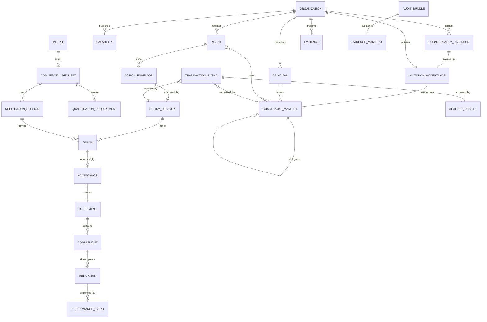

# Canonical commercial model v0.1

**Status:** Experimental working specification. Mixed. Sections 2, 3, 4, 7, 8, 9, 10, 11, 12, 13, 14, and 15 are **normative**. Sections 1, 5, 6, and 16 are **informative** and state no requirement on an implementation.

**Date:** 25 July 2026

**Revised:** 30 July 2026, under [A202-0016](../proposals/A202-0016-casing-short-form-and-amendment-corrections.md): the `Agreement` row of section 5.4 states the amendment rule section 10.1 already carries, in place of a deferral to a future specification. Also revised 30 July 2026, under [A202-0014](../proposals/A202-0014-bilateral-formation-and-scope-repair.md): the `PolicyDecision` owner named as the acting party's own evaluator, the bilateral discharge of the kernel role and the party-minted session identifier stated in section 9, the denied-decision invariant split into its privacy half and its shared-sequence half, and the restated fixture counts in section 15 replaced by the manifest they were already declared to defer to. Previously revised 28 July 2026, under [A202-0009](../proposals/A202-0009-enforcement-fidelity.md) and [A202-0010](../proposals/A202-0010-model-completion.md): signature protected members, the mandate's standalone status made explicit, the full payload-deferral list, agreement amendment, hash-recomputation invariants, and the corrected fixture-count statement. Further revised the same day under [A202-0012](../proposals/A202-0012-party-family-payloads.md), which defines the organization, agent, and principal payloads, and [A202-0013](../proposals/A202-0013-transaction-event-allowlist.md), which types the transaction stream and registers the `req_` prefix. Previous revision 26 July 2026 added the counterparty invitation objects; 25 July 2026 followed conformance review and horizontal-scope formalization.

**Scope:** Synthetic pilot transactions only

## 1. Purpose

This model gives A202 one protocol-independent and market-independent meaning for commercial identity, authority, discovery, negotiation, agreement, performance, settlement instructions, and audit.

External protocols may carry, wrap, or reference these objects. They do not define A202 transaction state.

### 1.1 Strategic scope

This document is the experimental core-primitives specification for horizontal commercial negotiation, meaning commercial coordination that is not specific to any one commercial domain.

Market-independent means that the kernel represents commercial coordination without embedding procurement, freight, cloud, energy, insurance, or another domain's vocabulary. It does not mean that one generic workflow is sufficient for every market. Domain meaning belongs in transaction profiles governed by the [transaction profile extension model](transaction-profile-extension-model-v0.1.md).

The reusable primitive map is:

| Commercial requirement | Kernel representation | Privacy or authority boundary |
|---|---|---|
| Parties and organizational identity | `Organization`, `Agent`, `Principal`, external identity assertions, key records | Public or selectively disclosed claims do not create commercial authority |
| Entry for a party that is not yet registered | `CounterpartyInvitation`, `InvitationAcceptance` | An invitation grants participation in one named transaction. It never grants authority, and the operator never issues the invited party's mandate |
| Delegated authority | `CommercialMandate`, `Delegation`, `Approval`, `RevocationRecord` | Scope is disclosed only as required for verification |
| Objectives, constraints, and approval thresholds | Mandate constraints and participant policy inputs | Objectives, reservation values, internal thresholds, and strategy remain participant-private |
| Typed proposals and counterproposals | `ActionEnvelope`, `Offer`, profile terms, supersession link | Only transmitted proposals enter a bilateral session |
| Evidence and representations | `Evidence`, qualification requirements, evidence manifest | Evidence has an explicit audience, issuer, scope, and verification result |
| Conditional commitments | `Agreement`, `Commitment`, `Obligation` | A condition becomes shared only when it is part of a disclosed proposal or agreement |
| Policy evaluation | `PolicyDecision` bound to one action hash | Underlying private rules need not be disclosed |
| Escalation to humans | `Approval` bound to one action hash | Approval discloses the decision and scope required by the workflow, not the private threshold |
| Acceptance, rejection, withdrawal, expiry, and revocation | Typed objects and authorized events in the state machines | Only an authorized event changes canonical state |
| Settlement or execution instructions | `SettlementInstruction`, adapter job, `AdapterReceipt` | Connectivity and receipts do not create authority or prove commercial completion |
| Auditable state transitions | Per-session and aggregate events, evidence manifest, audit bundle, replay | Each party sees only the streams and evidence it is authorized to hold |

### 1.2 Storage and source-of-truth boundary

The kernel defines meaning and visibility. It does not require every data class to be stored in one shared database.

- Participant-private strategy and policy remain in participant security domains.
- An operator may hold the canonical ordering and policy service for shared transaction and bilateral-session state.
- Authorized parties must be able to retain and independently verify signed records relevant to them.
- External execution systems remain authoritative for the facts they produce.

A canonical operating source is not an exclusive surviving copy. An operator may hold the authoritative ordering of shared state while every authorized party independently retains verifiable records of the parts that concern it, so that no party depends on the operator's continued existence to prove what happened.

## 2. Conformance language

The terms `MUST`, `MUST NOT`, `REQUIRED`, `SHOULD`, `SHOULD NOT`, and `MAY` are normative within this experimental specification.

A A202 v0.1 implementation conforms when it:

1. validates shared objects against `v0.1/commercial-kernel.schema.json`;
2. validates mandates against `v0.1/commercial-mandate.schema.json`;
3. resolves and validates transaction profiles under `v0.1/profiles/`;
4. enforces every invariant in section 12, which schema validation cannot express;
5. enforces the state transitions in `../negotiation/pilot-transaction-state-machine-v0.1.md`, and the onboarding rules in `../discovery/counterparty-invitation-v0.1.md`;
6. produces canonical hashes using the serialization profile in section 4;
7. passes every fixture in `../conformance/manifest-v0.1.json`.

Schema validity is necessary and not sufficient. An implementation that passes the schemas and fails section 12 is not conformant.

## 3. Common envelope

Every shared object MUST include:

| Field | Type | Rule |
|---|---|---|
| `spec_version` | string | Exact value `a202-commercial/0.1` |
| `id` | string | Type-prefixed immutable identifier |
| `object_type` | string | Registered A202 object type |
| `version` | integer | Starts at 1 and increases by 1 |
| `created_at` | RFC 3339 timestamp | UTC with `Z` |
| `created_by` | `ActorRef` | Agent, organization, and mandate |
| `transaction_id` | string or null | Required for transaction-bound objects |
| `previous_version_id` | string or null | Required after version 1 |
| `content_hash` | string | Lowercase hexadecimal SHA-256 over canonical content |
| `signatures` | array | Detached or embedded signatures over `content_hash` |
| `payload` | object | Object-specific fields validated for `object_type` |

Every shared object MAY additionally carry:

| Field | Type | Rule |
|---|---|---|
| `kernel_annotations` | object or absent | Control-plane metadata attached **after** signing. Excluded from `content_hash` and from every signature. Only the control plane may write it. An agent-authored `action_envelope` MUST NOT carry it. |

Type prefixes:

| Object | Prefix |
|---|---|
| Organization | `org_` |
| Agent | `agt_` |
| Principal | `prn_` |
| Mandate | `mnd_` |
| Capability | `cap_` |
| Intent | `int_` |
| Counterparty invitation | `inv_` |
| Invitation acceptance | `ina_` |
| Transaction | `txn_` |
| Negotiation session | `ses_` |
| Action envelope | `act_` |
| Offer | `off_` |
| Acceptance | `acc_` |
| Agreement | `agr_` |
| Commitment | `cmt_` |
| Obligation | `obl_` |
| Obligation response | `obr_` |
| Performance event | `prf_` |
| Exception | `exc_` |
| Dispute | `dsp_` |
| Determination | `det_` |
| Evidence | `evd_` |
| Event | `evt_` |
| Policy decision | `pol_` |
| Approval | `apr_` |
| Settlement instruction | `stl_` |
| Adapter receipt | `adp_` |
| Clarification | `clr_` |
| Key record | `key_` |
| Revocation record | `rev_` |
| Commercial request | `req_` |

Identifiers are opaque. No legal name, email, employee number, or secret may be encoded in an identifier.

### 3.1 The mandate is not an envelope object

A `CommercialMandate` is a standalone signed document under `v0.1/commercial-mandate.schema.json`, with `spec_version` `a202-mandate/0.1` and an issuer `proof` rather than the envelope's `signatures` array. It is not wrapped in the common envelope, `commercial_mandate` is not a member of the kernel's `object_type` enum, and an implementation MUST NOT accept a mandate presented in envelope form. Envelope objects reference a mandate by its `mnd_` identifier, which is why the prefix stays registered in the table above.

The exception exists because the mandate is the root of the authority chain that envelope objects are verified against. An envelope object names its authorising mandate in `created_by`; a mandate wrapped in that same envelope would name a mandate in its own `created_by`, and the chain would either recurse or terminate in an unverifiable self-reference. A standalone document signed by the issuing principal terminates the chain instead.

## 4. Canonicalization and signatures

1. JSON objects MUST be serialized using JSON Canonicalization Scheme, RFC 8785.
2. `content_hash`, `signatures`, and `kernel_annotations` MUST be omitted from the bytes being hashed.
3. The hash algorithm for v0.1 is SHA-256, encoded as 64 lowercase hexadecimal characters. Multibase is not accepted in v0.1.
4. A signature MUST identify the key, algorithm, signature value, signed time, and purpose.
5. The signature value MUST be computed over the object's canonical bytes from rule 2, followed by a single `.` byte, followed by the RFC 8785 serialization of an object holding the signature entry's own `algorithm`, `key_id`, `purpose`, and `signed_at` members. Those four members are thereby protected: rewriting any of them after signing invalidates the signature. An unprotected entry would be relabelable, so that a signature issued for one purpose could be presented as a signature for another, and a signed time could be moved to before a key's revocation, and neither edit would be detectable from the bytes.
6. Verification MUST resolve the key status at the signed time and at verification time. Key status resolves against the key's `KeyRecord` version chain: the version whose validity interval covered the signed time governs historical validity, and the latest version states current status.
7. An expired or revoked key does not erase a signature that was valid when created. Verification output MUST report both historical validity and current key status.

## 5. Object inventory

### 5.1 Party and identity

| Object | Purpose | Owner | Shared? | Mutable fields |
|---|---|---|---|---|
| `Organization` | Commercial participant and legal-entity reference | Organization | Public profile | Status through new version |
| `Agent` | Software actor bound to an organization and operator | Organization | Public profile | Endpoints, status, keys through new version |
| `Principal` | Human or organizational authority source | Organization | Restricted | Status and role through new version |
| `ExternalIdentityAssertion` | Evidence received from GLEIF, vLEI, or another issuer | Source holder | Scoped | Verification result only through new version |
| `KeyRecord` | Public verification material and lifecycle status | Key controller | Scoped | Status through new version |

### 5.2 Authority

| Object | Purpose | Owner | Shared? | Mutable fields |
|---|---|---|---|---|
| `CommercialMandate` | Delegated commercial authority and constraints | Issuing organization | Selectively disclosed | None; supersede or revoke |
| `Delegation` | Parent-child authority link | Delegator | Selectively disclosed | None |
| `Approval` | Human or deterministic approval of one exact action hash | Approver | Transaction parties as required | None |
| `PolicyDecision` | Deterministic allow, deny, or approval-required result | The acting party's own policy evaluator. A control plane is the operated deployment of that role, never a separate one | Governed by its `visibility` field | None |
| `RevocationRecord` | Suspension or revocation of agent, key, or mandate | Authorized controller | Verification surface | None |

### 5.3 Market

| Object | Purpose | Owner | Shared? | Mutable fields |
|---|---|---|---|---|
| `Capability` | What an organization can supply, where, and under which evidence | Supplier | Public or invited | Availability through new version |
| `Intent` | Bounded demand or supply signal | Publishing organization | Public, invited, or private | Status through state event |
| `CounterpartyInvitation` | Single-use, expiring grant of participation in one named transaction, issued at a party that may not be registered | Inviting organization | Inviting party, operator, and the one invited party | None; revoke or let expire |
| `InvitationAcceptance` | Record that a claim completed: channel proved, party registered, own root mandate issued | Control plane, attested by the claimant | Inviting party, operator, and the claimant | Assurance level through new version |
| `QualificationRequirement` | Evidence and rules required to participate | Buyer or market profile | Shared | None after publication |
| `Evidence` | Claim, artifact reference, issuer, scope, and verification | Presenting party | Scoped | Verification status through new version |

### 5.4 Transaction

| Object | Purpose | Owner | Shared? | Mutable fields |
|---|---|---|---|---|
| `CommercialRequest` | Typed request with requirements, terms, and qualification | Buyer | Shared with eligible parties | Clarified through linked objects |
| `Clarification` | Question and disclosed answer | Requester and respondent | Transaction scoped | None |
| `ActionEnvelope` | The agent-signed unit of intent that policy is evaluated against | Proposing agent | Not shared with the counterparty | None |
| `Offer` | Complete or partial proposed terms | Offering party | Session scoped | None; counter with a new offer |
| `Acceptance` | Signature over one current offer hash | Accepting party | Session scoped | None |
| `Agreement` | Canonical accepted terms and party signatures | Both parties | Transaction parties | None; amend by a superseding version reached through a fresh offer and acceptance, under section 10.1 |
| `TransactionEvent` | Signed fact that drives state | Authorized actor or system | According to event class and stream | None |

### 5.5 Performance and audit

| Object | Purpose | Owner | Shared? | Mutable fields |
|---|---|---|---|---|
| `Commitment` | Party promise derived from agreement | Obligated party | Shared | None |
| `Obligation` | Measurable duty, due condition, and acceptance rule | Obligated party | Shared | Status derived from events |
| `PerformanceEvent` | Delivery, milestone, inspection, or service result | Performing or verifying party | Shared | None |
| `Exception` | Claimed failure, variance, or remediation path | Raising party | Shared | Status derived from events |
| `SettlementInstruction` | Requested payment route and condition | Authorized party | Restricted | Status derived from receipts |
| `AdapterReceipt` | External system request and result | Connector plane | Restricted or shared | Attempt status through new receipt |
| `EvidenceManifest` | Hash-addressed inventory of transaction evidence | Control plane | Transaction parties | None |
| `AuditBundle` | Signed manifest, event root, and replay metadata | Control plane | Authorized auditors | None |

### 5.6 Payload shapes: defined and deferred, restated 28 July 2026

Not every member of the `object_type` enum has a payload definition in the kernel schema. The consequence is the same for every type that lacks one, and it is stated here rather than left to be discovered: schema validation of such a payload is not claimable in v0.1. An object of such a type validates against the common envelope and nothing else, so an implementation that reports it as schema-valid is reporting that the envelope validated.

An earlier revision of this section named three deferred types. That list was under-inclusive, and this revision states the full division.

**Payload-defined types.** `action_envelope`, `counterparty_invitation`, `invitation_acceptance`, `offer`, `acceptance`, `agreement`, `transaction_event`, `policy_decision`, `obligation`, `performance_event`, `obligation_response`, `dispute`, `determination`, `settlement_instruction`, `adapter_receipt`; added by A202-0010 because normative rules elsewhere lean on their contents, `approval`, `commitment`, `evidence`, `revocation_record`, and `key_record`; and added by A202-0012 as the three an implementer constructs first, `organization`, `agent`, and `principal`.

**Payload-deferred types.** `external_identity_assertion`, `capability`, `intent`, `qualification_requirement`, `commercial_request`, `clarification`, `delegation`, `exception`, `evidence_manifest`, and `audit_bundle`. Each is named in the inventory with a purpose, an owner, and a sharing rule, and each validates as envelope-only until a proposal lands its shape. `exception`, `evidence_manifest`, and `audit_bundle` sit here as recorded on 27 July 2026; the rest are exercised by the pilot through references rather than through their contents.

The `exc_` prefix is registered in section 3 ahead of its payload proposal, for a reason that does not wait. The generic identifier pattern admits any three-letter prefix, so two implementations can mint different prefixes for the same object type and both validate. Identifiers are opaque and long lived, and every reference written under one form stays written, so a prefix that diverges before publication diverges permanently. Registering the prefix costs nothing and closes that. The same reasoning registered `clr_`, `key_`, and `rev_` when their reference patterns tightened. `evidence_manifest` and `audit_bundle` carry no registered prefix here, because neither appears as a reference inside another object's payload in v0.1.

## 6. Relationship model



## 7. Money, quantity, and commercial terms

Money MUST use:

```json
{
  "currency": "EUR",
  "amount": "3200.00"
}
```

Rules:

- `currency` MUST be an ISO 4217 alphabetic code for fiat values.
- `amount` MUST be a base-10 string, never a binary floating-point number.
- `amount` MUST be non-negative. A credit, refund, or downward adjustment is expressed as a directed adjustment object with its own type, not as a negative price. This prevents a sign error from silently inverting consideration.
- Percentages MUST be decimal strings in the closed interval `"0"` to `"100"`. A value above 100 is invalid.
- Quantities MUST use `unit_code` from UN/ECE Recommendation 20. This is the declared controlled vocabulary. `unit_name` is an optional human label and MUST NOT be used for matching or validation.
- Dates MUST state a time zone or a business-calendar reference. A duration expressed in business days without a named calendar is not a term.
- A term omitted from an offer is not accepted by implication unless a transaction profile defines a default and both parties reference the same profile version.

## 8. Transaction profiles and market neutrality

The kernel is market-neutral. This is a testable property, not a stated intention.

1. `terms` has exactly three parts: `profile`, `core`, and `profile_terms`.
2. `core` is identical for every transaction type: description, quantity, unit code, and total.
3. `profile_terms` is **opaque to the kernel**. The kernel validates only that a profile identifier resolves in the profile registry; the profile's own schema validates the terms.
4. The kernel schema MUST NOT contain a field, enum member, or constant that is meaningful in only one transaction profile.
5. An unresolvable profile fails closed with `A202-PROFILE-UNKNOWN`.

**Neutrality test.** `../conformance/fixtures/v0.1/valid-offer-alternate-profile.json` uses a transaction profile with entirely different commercial terms. It MUST validate against the unchanged kernel schema. If adding a transaction profile ever requires a kernel change, the kernel is not canonical and the market-neutrality property claimed in this section has failed.

The calibration-service profile is a synthetic pilot fixture. Its presence in `v0.1/profiles/` does not select a market and is not a statement that any commercial domain is in scope.

## 9. Action, policy, and offer ordering

An offer does not contain the policy decision that authorized it. That would be circular: the decision is computed over the offer, so embedding the decision identifier inside the signed offer would change the hash the decision was taken against.

The order is:

1. The agent constructs a candidate object and wraps it in a signed `ActionEnvelope`.
2. `action_hash` is the canonical hash of the `ActionEnvelope`.
3. The policy evaluator returns a `PolicyDecision` bound to that `action_hash`.
4. On `allow`, the kernel mints the commercial object and attaches `kernel_annotations` containing `policy_decision_id`, `session_id`, `session_sequence`, and `received_at`.
5. Because annotations are excluded from the hashed bytes, the agent's signature remains valid.

An offer payload MUST contain:

- `offeror` and `offeree`;
- `session_id`;
- `supersedes_offer_id` when it is a counteroffer;
- `valid_until`;
- a complete `terms` object for every term required by the transaction profile;
- evidence references.

An offer MUST NOT contain private objectives, scoring weights, reservation values, hidden prompts, or untransmitted alternatives.

### 9.1 Who discharges the kernel role

Step 3 and step 4 above name a policy evaluator and a kernel. Neither names a third organisation, and this section states which party performs each act so that the ordering is executable with no operator present.

1. **Each party evaluates its own proposed actions.** The evaluator in step 3 is the acting party's own. It returns a `PolicyDecision` bound to the `action_hash` of that party's own `ActionEnvelope`, and the decision is signed by that party under its own key. A party never evaluates a counterparty's proposed action and never issues a decision about one, in either scope. Where an operator is present it deploys this role as a control plane and the decision it issues is a decision about the actions of the party it acts for; the role is the same role, deployed once rather than twice.
2. **The kernel in step 4 is a role, not a party.** Where no operator is present, each party's own runtime discharges it over its own proposed actions: it mints the commercial object on `allow`, applies the object rules of this document to it, and signs it. Nothing in step 4 requires a party other than the two, other than the annotations, which are the next rule.
3. **`kernel_annotations` are control-plane only and are absent bilaterally.** The annotation members in step 4 record what an ordering service observed: `policy_decision_id`, `session_id`, `session_sequence`, and `received_at`. Where there is no ordering service, there is nothing to record and the member is absent. An object emitted bilaterally MUST NOT carry `kernel_annotations`, and a party that received one has received an object that passed through a control plane. This changes nothing about the existing rule in section 3 that only the control plane may write the member; it states what follows from that rule where no control plane exists.
4. **A decision the verifier was not given is a stated gap.** Because each party issues its own decisions, a verifier holding one party's record will not hold the other party's decisions. Step 5 item 4 of [evidence-verification-v0.1.md](../evidence/evidence-verification-v0.1.md) section 4 requires the referenced `PolicyDecision` to resolve; where it was not disclosed, the check is reported as `not_checkable` under step 7 and never as verified.

### 9.2 The session identifier bilaterally

`session_id` is REQUIRED on an offer payload and stays REQUIRED. A bilateral exchange is a session in the sense the model uses the word: one relationship with one counterparty, carrying the offers, counteroffers, and acceptance between them.

What differs bilaterally is who establishes it. The parties establish it themselves: the offeror mints the `ses_` identifier on its first offer, and the counterparty adopts it as it adopts the offer's other bytes, referencing the same value on its acceptance and on any counteroffer. There is no session stream, no session sequence, and no ordering service, so nothing has to be created by a third party before an offer can be made. An identifier minted by one party and adopted by the other is sufficient for every use the model makes of `session_id`: it groups the objects of one relationship and it is opaque, which is all section 3 requires of an identifier.

Where an operator is present it creates the session and its stream on `negotiation.opened`, and the identifier is the operator's. The field is the same field and the schema is unchanged; only the minting party differs.

## 10. Agreement formation

An agreement is formed in the pilot only when:

1. the offer is current and unexpired;
2. the offeror signature is valid;
3. the offeree signs an `Acceptance` over the exact offer hash;
4. both sides pass authority and policy checks;
5. any required approvals reference the same offer hash;
6. the kernel creates an `Agreement` that names the `Acceptance` and whose terms hash equals the accepted offer terms hash;
7. both parties sign the agreement hash;
8. an `agreement.committed` event is appended.

Any hash mismatch fails with `A202-AGREEMENT-HASH-MISMATCH`. `terms_hash` and `accepted_offer_hash` are recomputed by any party relying on the agreement, never trusted from the object: an agreement whose signed summary and signed content disagree fails with the same code.

### 10.1 Amendment

An amendment replaces a committed agreement's terms by consent, through the same mechanism that formed them. It is adopted through [A202-0010](../proposals/A202-0010-model-completion.md).

1. An amendment is a new agreement version: `version` increments by one, `previous_version_id` names the superseded version, and the superseded version remains in the record unchanged.
2. The amended terms MUST be reached through a fresh offer and a fresh `Acceptance` over that offer's exact hash, under the parties' mandates and policy checks, exactly as section 10 formed the original. A later agreement version that names the same `acceptance_id` or the same `accepted_offer_id` as the version it supersedes is a unilateral restatement, not an amendment, and fails with `A202-AGREEMENT-AMENDMENT-UNACCEPTED`.
3. Both parties MUST sign the amended version. One signature is not an amendment.
4. `agreement.amended` is appended to the transaction stream. It changes no aggregate state: a transaction in `committed` stays in `committed`, and one in `in_performance` stays in `in_performance`.
5. An obligation continues to reference the `terms_hash` of the agreement version it derived from, and its version chain is what resolves that reference. A duty the amendment adds or changes is a new obligation under the new version. A duty the amendment removes is discharged by the obligee's `waive` response against the existing obligation, so that the release is a signed act of the party it releases, not a side effect of the amendment.

## 11. Event streams and aggregate rules

Events belong to a named stream. There are two stream kinds:

| Stream kind | Contains | Readable by |
|---|---|---|
| `transaction` | Publication, qualification, selection, commitment, performance, settlement, exception | Transaction parties |
| `session` | Everything inside one bilateral negotiation: offers, counteroffers, clarifications, acceptance | The two parties to that session only |

Bilateral negotiation events MUST NOT be appended to the transaction stream while competing sessions are open. A shared monotonic counter across concurrent sessions is a covert channel: a supplier that observes the counter advance learns that a rival acted, and when. Sequence numbers are therefore per stream.

Other rules:

- Events are append-only and ordered by sequence within their own stream.
- Each event includes the previous event hash **within that stream**.
- Derived state is a materialized view, not the source of truth.
- A failed side effect creates a new event or adapter receipt. It never edits the original event.
- Replaying the same valid event streams MUST produce the same aggregate state.
- An event signed by an unauthorized actor MUST be rejected before append.
- A `deny` decision MUST NOT consume a sequence number in any shared stream. It is recorded in the actor's private stream with `visibility: private_to_actor`.

## 12. Invariants that schema validation cannot express

An implementation MUST enforce each of the following. `../conformance/run-conformance.py` checks them, and each has a negative fixture.

| Invariant | Reason code |
|---|---|
| A mandate's `valid_from` is strictly earlier than its `valid_until` | `A202-MANDATE-INTERVAL-INVALID` |
| An offer's `valid_until` is strictly later than its `created_at` | `A202-OFFER-EXPIRED` |
| The transaction profile named in `terms.profile` resolves in the registry | `A202-PROFILE-UNKNOWN` |
| `terms.profile_terms` validates against that profile's schema | `A202-PROFILE-TERMS-INVALID` |
| A `deny` decision is private to the actor and is disclosed to no counterparty | `A202-DISCLOSURE-DENIED` |
| A `deny` decision consumes no sequence number in a shared stream | `A202-DISCLOSURE-DENIED` |
| A child mandate is equal to or narrower than its parent on every axis | `A202-MANDATE-DELEGATION-WIDENING` |
| An unregistered constraint type or operator fails closed at evaluation as well as at validation | `A202-MANDATE-CONSTRAINT-UNKNOWN` |
| `kernel_annotations` are excluded from the bytes covered by `content_hash` and every signature | `A202-ANNOTATION-FORGED` |
| An invitation's `expires_at` is strictly later than its `created_at` | `A202-INVITATION-EXPIRED` |
| An invitation's `granted_scope.transaction_ids` contains exactly its own `transaction_id` | `A202-INVITATION-SCOPE-EXCEEDED` |
| An invitation acceptance carries both a claimant `invitation_claim` signature and an operator `object_issuance` signature | `A202-INVITATION-CLAIM-UNSIGNED` |
| An assurance level above `self_asserted` is supported by at least one evidence reference | `A202-ASSURANCE-UNSUPPORTED` |
| An operator-custodied key carries a bound principal approval | `A202-CUSTODY-APPROVAL-REQUIRED` |
| A session-stream event discloses no rival identity, price, count, or timing | `A202-DISCLOSURE-POLICY-VIOLATION` |
| An event's `data` carries no rival-disclosing member on any stream kind, at any depth. The transaction stream is covered because the winning counterparty reads it after commitment | `A202-DISCLOSURE-POLICY-VIOLATION` |
| A policy decision returns no reason code that discloses aggregate state to the actor | `A202-DISCLOSURE-POLICY-VIOLATION` |
| An agreement's `terms_hash` equals the recomputed hash of its own `terms`, and its `accepted_offer_hash` equals the accepted offer's `content_hash` | `A202-AGREEMENT-HASH-MISMATCH` |
| A later agreement version names a fresh acceptance and a fresh accepted offer, per section 10.1 | `A202-AGREEMENT-AMENDMENT-UNACCEPTED` |
| A determination's `state_result` names the determined subject and a registered state, and appears only under a `binding` effect | `A202-STATE-TRANSITION-DENIED`, `A202-DETERMINATION-EFFECT-OVERCLAIM` |

Adding a constraint type to the schema enum without an evaluator implementation MUST NOT cause the action to be allowed. Both layers fail closed independently. The delegation-narrowing invariant is exercised statically by the `mandate_chain` fixtures, which carry a parent and child pair so that every axis of narrowing is checkable without runtime state.

The denied-decision invariant is stated as two rows rather than one because its halves hold in different places. Privacy toward the counterparty holds wherever a decision exists, and either party checks it on any decision it receives. The shared-sequence half is a property of a stream an ordering service assigns numbers on, and where no such service exists there is no shared sequence for a decision to consume: a denied action is simply never countersigned into the record described in section 8.1 of [pilot-transaction-state-machine-v0.1.md](../negotiation/pilot-transaction-state-machine-v0.1.md). One row carrying both meant the partition in [conformance-role-scopes-v0.1.md](../conformance/conformance-role-scopes-v0.1.md) had to split a row against itself, which is what these two rows remove. Both refuse with the same code, because a relying party's correct response to either is the same refusal.

### 12.1 Event data is an allowlist on every stream

Every event carries a closed `data` shape. There are three, and between them they cover the whole transaction and session lifecycle.

| Event | Shape | Permitted content |
|---|---|---|
| Moves the session to `rejected`, `withdrawn`, `expired`, or `closed` | `sessionCloseData` | One `close_reason` from a closed enum |
| Every other session event | `sessionEventData` | Pattern-checked object references only: `offer_id`, `supersedes_offer_id`, `acceptance_id`, `clarification_id`, `approval_id` |
| Every transaction-stream event | `transactionEventData` | Pattern-checked object references and bound hashes only, covering the aggregate lifecycle. No member is required: most aggregate transitions are fully described by `from_state`, `event_type`, and `to_state` |

Two rules make this work:

1. **Allowlist, not denylist.** A denylist refuses only the leaks someone anticipated. A free-text field named `note` carrying "three others bid" defeats any keyword filter and is refused here by construction.
2. **References, never content.** An event names the signed object it concerns; it never restates the object's terms. The referenced object enforces its own visibility and private-field validation separately. Every reference pattern is bound to its registered prefix, which constrains what family an identifier claims; it does not make the identifier's characters incapable of carrying a value, because no pattern can. Full opacity is enforced at resolution: an identifier on a session stream that resolves to no object is refused, and an identifier is never rendered as content. The pattern is the static layer, resolution is the enforcing one, and both fail closed on their own.

The evaluator denylist remains as an independent second layer, and applies to every stream kind at any nesting depth. Both layers must fail closed on their own: widening either allowlist without updating the evaluator, or the reverse, must not let a leak through.

**Why the transaction stream is typed too.** An earlier revision left transaction-stream `data` an open object, reasoning that suppliers act on session streams and never read the transaction stream, so its audience is the buyer, the operator, and scoped auditors. That reasoning was incomplete in one case that matters: after `agreement.committed` the winning counterparty is a party to the transaction and reads the stream, so an award or commitment event carrying a losing rival's price, identity, or count discloses across counterparties on exactly the boundary the session design exists to protect. Typing the aggregate lifecycle closes it, and the cost is low because the aggregate transitions are few and reference-shaped. This is [A202-0013](../proposals/A202-0013-transaction-event-allowlist.md).

## 13. Private strategy boundary

The following data classes MUST remain outside the shared kernel:

- maximum willingness to pay unless deliberately disclosed;
- minimum acceptable price;
- scoring weights;
- negotiation tactics;
- supplier or buyer rankings not yet disclosed;
- model prompts, reasoning traces, and hidden memory;
- draft offers not transmitted;
- confidential information that the mandate prohibits disclosing;
- the existence, count, and timing of a party's rejected proposals.

The kernel may store a hash of a private record for later integrity proof. It MUST NOT require the record's contents.

## 14. Versioning

- v0.1 objects use `spec_version: a202-commercial/0.1`.
- Unknown object types or required fields fail validation.
- Additive optional fields require a registered extension namespace.
- A breaking semantic change requires a new specification version.
- Adapters MUST declare the kernel version and external specification version used for each receipt.
- A transaction profile versions independently of the kernel. A new profile is not a kernel change.

## 15. Conformance fixtures

The executable set is `../conformance/manifest-v0.1.json`, run by `../conformance/run-conformance.py`. The manifest is the single source for what the set contains and how large it is; a count restated in prose goes stale the first time the set grows, and three of this repository's own documents proved that, including the sentence that used to stand here and that had gone stale by two proposals. No count is restated here. The runner asserts that each negative fixture is refused for its declared reason code where the normative layer raises codes at all. The set is deliberately weighted toward the refuse direction, because a specification is tested by what it refuses.

A conformant implementation MUST be verified against coverage of each of the following:

1. Valid organization, agent, and mandate chain.
2. Expired, revoked, and suspended mandate rejection.
3. Unknown constraint type and operator rejection.
4. Offer with missing required term rejection.
5. Offer with binary floating-point money rejection.
6. Counteroffer linked to a stale offer rejection.
7. Acceptance hash mismatch rejection.
8. Agreement party-signature mismatch rejection.
9. Duplicate event with identical idempotency key returns original result.
10. Duplicate event with different content returns conflict.
11. Event-chain tampering fails replay.
12. Private field in a shared object fails data-classification validation.
13. Adapter retry does not duplicate an external order.
14. Market-neutrality probe: a second transaction profile validates without a kernel change.
15. Cross-session isolation: a session event is not visible in the transaction stream.
16. Onboarding by invitation: an organization with no prior A202 presence claims an invitation, issues its own root mandate, and reaches an agreement.
17. An operator-custodied key cannot move state without an approval bound to the exact action hash.
18. Invitation isolation: an invited party cannot determine how many other invitations were issued on the same transaction.
19. Delegation narrowing: a child mandate that outlives, out-scopes, out-acts, or out-spends its parent is refused on each axis independently.
20. Amendment: a superseding agreement version is reached only through a fresh offer and acceptance, and a re-versioned agreement nobody re-accepted is refused.
21. Consensual termination: `termination.agreed` ends a committed transaction under the rules version that permits it, is illegal under the versions that never did, and releases open obligations rather than stranding them.
22. Direct formation: two parties reach an agreement through `agreement.direct` with no operator-authored, operator-ordered, or operator-annotated object anywhere in the record, the same transition is illegal under the rules versions that never carried it, and it is refused on a transaction that already carries a session stream.

Items 1 to 3, 6 to 11, and 16 to 18 require runtime state and cannot be expressed as static documents. They are verified against a running implementation rather than against a fixture file. Items 19 to 22 are exercised statically: 19 by the `mandate_chain` fixtures, 20 to 22 by bundle fixtures. The full invitation test list is in [counterparty-invitation-v0.1.md](../discovery/counterparty-invitation-v0.1.md) section 12.

## 16. Open questions

- Whether the public specification should use JSON-LD contexts or plain JSON Schema plus explicit mappings.
- Which signature suites should be mandatory beyond the pilot.
- How selective disclosure should be implemented for mandates and evidence.
- Whether agreement objects should map directly to an existing contract standard.
- Whether the profile registry should be centrally curated, self-asserted with conformance testing, or both.

The question of which object families belong to this specification and which behaviours belong to an implementation that operates a venue is settled and is stated in the scope and non-goals sections of [CHARTER.md](../CHARTER.md), not reopened here.
